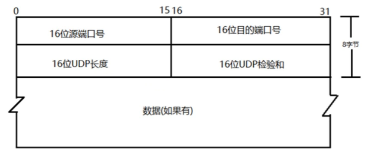
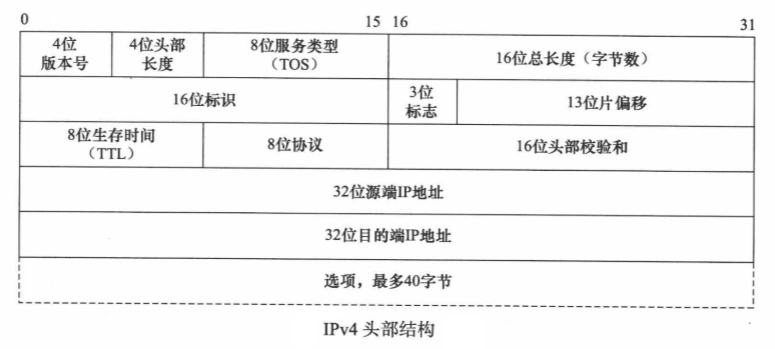
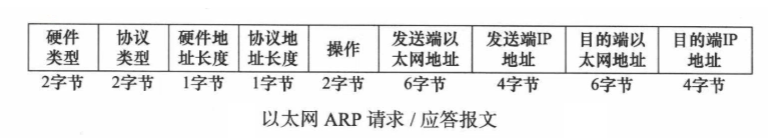
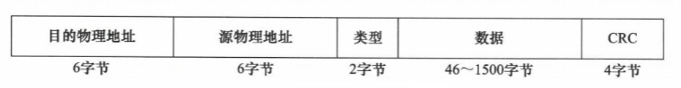
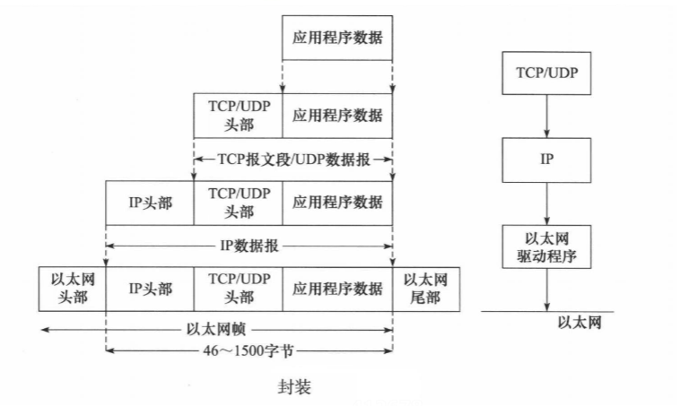
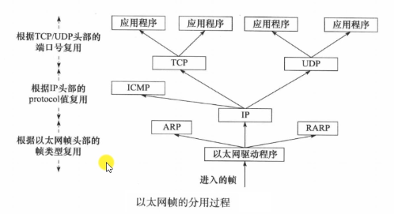

# 网络编程

### 基础知识
- 网络结构模式:
    - C/S结构:客户机/服务器,即Client/Server结构,C/S结构通常采取两层结构,服务器负责数据的管理,客户机负责完成与用户的交互任务,客户机是因特网上访问别人信息的机器,服务器则是提供信息供人访问的计算机
        - 客户机通过局域网与服务器相连,接受用户的请求,并通过网络向服务器提出请求,对数据库进行操作,服务器接受客户机的请求,将数据交给客户机,客户机将数据进行计算并将结果呈现给用户.服务器还用提供完善安全保护及对数据完整性的处理操作,并允许多个客户机同时访问服务器,这就对服务器的硬件处理数据的能力提出了很高的要求.
        - 在C/S结构中,应用程序分为两部分:服务器部分和客户机部分.服务器部分是多个用户共享信息与功能,执行后台服务,如控制共享数据库的操作等,客户机部分是为用户所专有,负责执行前台功能,在出错提示,在线帮助等方面都有强大的功能,并且可以在子程序间自由切换
        - 优点:
            - 能充分发挥客户端PC的处理能力,很多工作可以在客户端处理后再提交给服务器,所以C/S结构客户端响应速度快
            - 操作界面漂亮,形式多样,可以充分满足客户自身的个性化需求
            - C/S结构的管理信息系统具有较强的事务处理能力,能实现复杂的业务流程
            - 安全性较高,C/S结构一般面向固定的用户群,程序更加注重流程,可以对权限进行多层次校验,提供了更安全的存取模式,对信息安全的控制能力很强,一般高度机密的信息系统采用C/S结构适宜
        - 缺点:
            - 客户端需要安装专用的客户端软件.涉及到安装的工作量,其次任何一台电脑出问题,如病毒,硬件损坏,都需要进行安装和维护.系统软件升级时,每一台客户机需要重新安装,其维护成本非常高;
            - 对客户端的操作系统一般也会有限制,不能够跨平台
    - B/S结构:浏览器/服务器,即Browser/Server结构,是WEB兴起后的一种网络结构模式,WEB浏览器是客户端最主要的应用软件.这种模式统一了客户端,将系统功能实现的核心部分集中到服务器上,简化了系统的开发,维护和使用.客户机上只需要安装一个浏览器,如Firefox或Internet Explorer,服务器安装SQL Server,Oracle,MySQL等数据库.浏览器通过Web Server同数据库进行数据交互.
        - 优点:B/S架构最大的优点是总体拥有成本低,维护方便,分布性强,开发简单,可以不用安装任何专门的软件就能实现在任何地方操作,客户端0维护,系统扩展非常容易,只要有一台能上网的电脑就能使用
        - 缺点:
            - 通信开销大,系统和数据安全性较难保障
            - 个性特点明显降低,无法实现具有个性化的功能要求
            - 协议一般是固定的:http/https
            - 客户端服务器的交互是请求-响应模式,通常动态刷新页面,响应速度明显降低

### 地址
- MAC地址:长度为48位(6个字节)，通常表示为12个16进制数,MAC地址在一定程度上与硬件一致，是基于物理的，能够标识具体的网络节点
- IP地址:长度为32位(4个字节)
    - 给因特网上的每一台主机或路由器的每一个接口分配一个全世界范围内唯一分32比特的标识符
    - 历史阶段：分类编址->划分子网->无分类编址
    - 分类编址
        - 点分十进制来表示
        - A（0，高8位为网络号）、B（10，高16位为网络号）、C（110，高24位为网络号）、D（1110）、E（1111）类网络地址
        - 只用A类、B类、C类地址可以分配给网络中的主机或路由器的各接口，D类地址是多播地址，E类地址是保留地址
        - 特殊的网络地址:
            - 0.0.0.0
                - 当一台主机还没有被分配一个IP地址的时候，用于表示主机本身。（DHCP分配IP地址的时候）
                - 用作默认路由，表示”任意IPV4主机”。
                - 用来表示目标机器不可用。
                - 用作服务端，表示本机上的任意IPV4地址。
            - 255.255.255.255是当前子网的广播地址
            - 127.0.0.1~127.255.255.255用于回路测试(回环地址)
    - 划分子网
        - 点分十进制来表示
        - 子网掩码
    - 无分类编址：
        - 斜线记法，斜线后面写上网络前缀所占的比特数量
        - 路由聚合（构造超网）
- 端口(port):长度为16位(2个字节),IP地址相当于一个房子,端口就相当于门,端口可以有65536(2^16)个
    - 周知端口(well known port):众所周知的端口,也叫知名端口,范围从0到1023,紧密绑定一些特定的服务
        - 80端口:WWW服务
        - 21端口:FTP服务
        - 23端口:Telnet服务
    - 注册端口(registered ports):端口号从1024到49151,绑定于一些服务,分配给用户进程或应用程序,这些进程主要是用户选择安装的一些应用程序,而不是已经分配好了公认端口的常用程序.这些端口在没有被服务器资源占用时,可以用用户端动态选用为源端口
    - 动态端口/私有端口(Dynamic/Private Ports):动态端口的范围时从49152到65535,一般不固定分配某种服务,而是动态分配

### 网络模型
- osi七层参考模型
    - 应用层：为应用程序提供服务
    - 表示层：数据格式转化，数据加密
    - 会话层：建立，管理和维护会话
    - 传输层：建立，管理和维护端到端的连接，定义了传输数据的协议和端口号，将下层接收的数据进行分段和传输，到达目的地址后再进行重组（段）
    - 网络层：IP地址及路由选择，进行逻辑地址寻址，为不同主机提供逻辑连接和路由选择
    - 数据链路层：提供介质访问和链路管理，进行硬件地址寻址，差错校验等功能（帧）
    - 物理层：定义物理设备标准，接口类型，介质传输速率；传输比特流（比特）
- tcp/ip四层参考模型
    - 应用层: 用户空间
        - HTTP:超文本传输协议
        - FTP:文件传输协议
        - NFS:网络文件系统
        - DNS:域名解析协议
        - DHCP：动态主机配置协议
    - 传输层: 内核空间
        - TCP:传输控制协议
        - UDP:用户数据报协议
    - 网络层: 内核空间
        - ARP:地址解析协议，通过IP地址获取设备的MAC地址 
        - RARP:逆地址解析协议，通过MAC地址获得IP地址      
        - IP：因特网互联协议
        - ICMP:因特网控制报文协议
        - IGMP:因特网组管理协议
    - 网络接口层(数据链路层):内核空间
        - 以太网帧协议
### 需要掌握的协议
- TCP:传输控制协议:面向连接的单播协议,使用三次握手建立连接,使用字节流,处理IP层以下层的丢包,重复以及错误等问题
    - 
    - 源端口号:发送方端口号(2字节)
    - 目的端口号:接收方端口号(2字节)
    - 序列号:本报文段数据的第一个字节的序号(4字节)
    - 确认序号:期望收到对方下一个报文段的第一个字节的序号(4字节)
    - 首部长度(数据保留):TCP报文段的数据起始处距离TCP报文段的起始处有多远,即首部长度.(4比特)
    - 保留字段:(6比特)
    - 6位标志位:(6比特)
        - URG:置1表示紧急指针字段有效
        - ACK:应答,置为1时确认序号才有效
        - PSH:提示接收端应用程序立即从TCP缓冲区把数据读走
        - RST:重置,要求重新建立连接
        - SYN:请求建立连接,仅在三次握手建立TCP连接时有效
        - FIN:终止,释放一个连接
    - 16位窗口大小:指发送本报文段的一方的接受窗口(不是自己非发送窗口)(2字节)
    - 16位校验和:(2字节)
    - 16位紧急指针:紧急发送的数据的地址(2字节)
    - 选项:(最多40字节)

- UDP:用户数据报协议
    - 
    - 源端口号:发送方端口号(2字节)
    - 目的端口号:接收方端口号(2字节)
    - 长度:UDP用户胡数据报的长度,最小值为8(仅有首部)(2字节)
    - 校验和:检测UDP用户数据报在传输中是否有差错,有错就丢弃(2字节)

- IP：因特网互联协议
    - 
    - 4位版本号:
    - 4位头部长度:单位是32位
    - 8位服务类型:一般不使用
    - 16位总长度:首部加上数据的总长度,单位位字节
    - 16位标识:IP软件在存储器中维持一个计数器,每产生一个数据报,计数器就加1,并将此值给标识字段
    - 3位标志:目前只有两位有意义
        - 最低位位MF:为1的时候表示后面还有分片的数据报,为0表示这是若干分片数据报中的最后一个
        - 中间位为DF:为1表示不能分片,为0表示允许分片
    - 13位片偏移:指出较长的分组在分片后,某片在源分组中的相对位置.以8字节位单位
    - 8位生存时间TTL:表面数据报在网络中的寿命,每被转发一次就减一,当为0时就被丢弃
    - 8位协议:指出此数据报携带的数据使用何种协议,以便目的主机的IP层知道应将数据部分交给哪个处理过程,常用ICMP(1),IGMP(2),TCP(6),UDP(17),IPv6(41)
    - 16位头部校验和:只对首部进行校验,不包括数据部分
    - 源地址:发送方的IP地址(4字节)
    - 目的地址:接收方的IP地址(4字节)

- ARP:地址解析协议，通过IP地址获取设备的MAC地址 
  - 
  - 硬件类型:1表示MAC地址(2字节)
  - 协议类型:0x800表示IP地址(2字节)
  - 硬件地址长度:6(1字节)
  - 协议地址长度:4(1字节)
  - 操作:1表示ARP请求,2表示ARP应答,3表示RARP请求,4表示RARP应答
  - 发送端以太网地址:(6字节)
  - 发送端IP地址:(4字节)
  - 目的端以太网地址:(6字节)
  - 目的端IP地址:(4字节)  

- 以太网帧协议:有好几种具体协议,此处只是概略介绍
    - 
    - 目的物理地址:(6字节)
    - 源物理地址:(6字节)
    - 类型:(2字节)
        - 0x800:IP
        - 0x806:ARP
        - 0x835:RARP
    - 数据:(46~1500字节)
    - CRC校验码:(4字节)

### 协议传输的过程 
- 封装:
    - 
- 分用：当帧到达目的主机时，将沿着协议栈自底向上依次传递，各层协议依次处理帧中本层负责的头部数据，一获取所需的信息，并最终将处理后的帧交给目标应用程序，这个过程称为分用(demultiplexing),依靠头部信息中的类型字段实现
    - 

### 查看网络信息相关命令:
- netstat
  - 参数:
    - -a:所有的socket
    - -p:显示所有正在使用socket的程序的信息
    - -n:直接使用IP地址,而不通过域名服务器

### 字节序
  - 大端字节序:一个整数的最高位字节(23-31比特)存储在内存的低地址处
  - 小端字节序:一个整数的最高位字节存储在内存的高地址处
  - 网络字节序:TCP/IP中规定好的,采用大端排序方式
  - 字节序转换函数
      - #include<arpa/inet.h>
      - unit16_t htons(unit16_t hostshort); //通常用来转换端口
      - unit16_t ntohs(unit16_t netshort);
      - unit32_t htonl(unit32_t hostlong);  //通常用来转换IP地址
      - unit32_t htonl(unit32_t hostlong);
      - h:主机字节序  n:网络字节序  s:unsigned short,短整型(2字节)  l:unsigned int 长整型(4字节)

  - IP地址转换:字符串IP转换为整数,主机网络字节序的转换
    - 旧的函数
      - in_addr_t inet_addr(const char* cp);
      - int inet_aton(const char* cp,struct in_addr* inp);
      - char* inet_ntoa(struct in_addr in);
    - 新的函数:
      - int inet_pton(int af, const char* src, void* dst);
        - 作用:将点分十进制的IP字符串转换为整数
        - 参数:
          - af:地址族 AF_INET, AF_INET6
          - src:需要转换的点分十进制的IP字符串
          - dst:转换后的结果保存在这个里面,传出参数
        - 返回值:
          - 成功:1
          - 非法:0
          - 失败:-1
      - const char* inet_ntop(int af, const void* src,const char* dst, socklen_t size);
        - 作用:将网络字节序的整数转换为点分十进制的IP地址字符串
        - 参数:
          - af:地址族 AF_INET, AF_INET6
          - src:需要转换的IP地址整数值
          - dst:转换后的结果保存在这个里面,传出参数
          - size:第三个参数的大小
        - 返回值:返回转换后的数据的地址(字符串),和dst是一样的