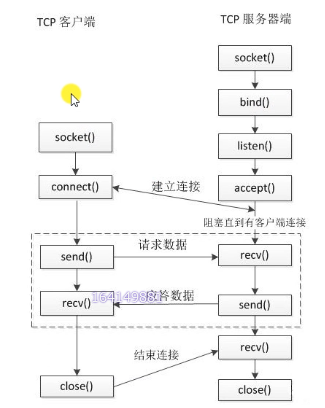
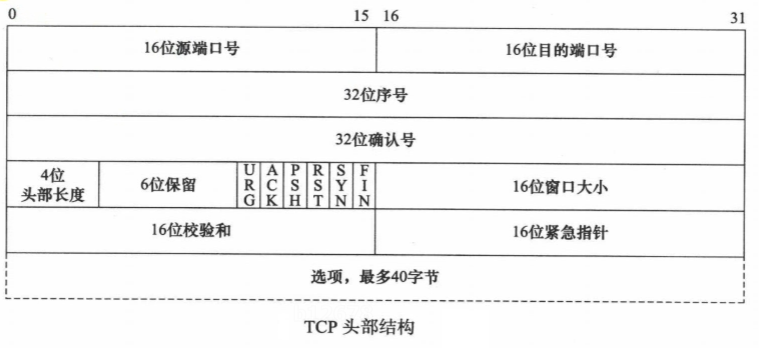
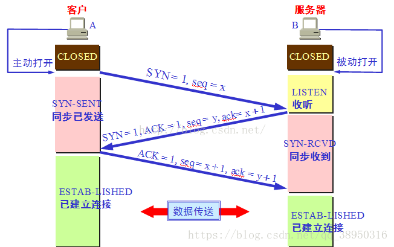

### TCP通信流程

- 服务器端(被动接受连接的角色)
  - 1.创建一个用于监听的套接字:
    - 监听客户端的连接
    - 套接字:其实就是文件描述符
  - 2.将套接字和本地的IP和端口绑定(服务器的地址信息)
    - 客户端连接服务器的时候用的就是这个IP和端口
  - 3.设置监听
  - 4.阻塞等待,当有客户端发起连接接触阻塞,接受客户端的连接,会得到一个和客户端通信的套接字(之前的套接字是用来监听连接请求的)
  - 5.通信
    - 接收数据
    - 发送数据
  - 6.通信结束,断开连接

- 客户端
  - 1.创建一个用于通信的套接字
  - 2.连接服务器,需要指定连接的服务器的IP和端口
  - 3.连接成功,进行通行
    - 接收数据
    - 发送数据
  - 4.通信结束,断开连接

- 函数：
  - int socket（int domain， int type， int protocol）
    - 功能：创建一个套接字
    - 参数：
      - domain：协议族
        - AF_INET:IPv4协议族
        - AF_INET6:IPv6
        - AF_UNIX,AF_LOCAL:本地套接字（进程间通信）
      - type：通信过程中使用的协议
        - SOCK_STREAM:流式协议
        - SOCK_DGRAM：报式协议
      - protocol：具体的一个协议，一把写0
        - SOCK_STREAM:流式协议，默认使用TCP
        - SOCK_DGRAM：报式协议，默认使用UDP
    - 返回值：
      - 成功：返回文件描述符，操作的是内核缓冲区
      - 失败：-1
  - int bind(int sockfd， const struct sockaddr* addr， socklen_t addrlen)
    - 功能:绑定,将fd和本地IP+端口绑定
    - 参数:
      - sockfd:通过socket()得到的文件描述符
      - addr:需要绑定的地址(封装了IP和端口号)
      - addelen:第二个参数的大小
    - 返回值:
      - 成功:0
      - 失败:-1
  - int listen(int sockfd, int backlog)
    - 功能:监听有无连接请求
    - 参数:
      - sockfd:通过socket()得到的文件描述符
      - backlog:未连接的请求和已连接的请快快快求加和的最大值
    - 返回值:
      - 成功:0
      - 失败:-1
  - int accept(int sockfd, struct sockaddr* addr, socklen_t addrlen)
    - 功能:接受客户端的连接,默认为阻塞函数,阻塞等待客户端的连接
    - 参数:
      - sockfd:通过socket()得到的文件描述符
      - addr:传出参数,记录了连接成功后客户端的地址信息(IP+port)
      - addrlen:指定第二个参数对应的内存的大小
    - 返回值:
      - 成功:返回用于通信的文件描述符
      - 失败:-1
  - int connet(int sockfd, struct sockaddr* addr, socklen_t addrlen)
    - 功能:客户端的连接请求
    - 参数:
      - sockfd:用于通信的文件描述符
      - addr:客户端要连接的服务器的地址
      - addrlen:第二个参数的大小
    - 返回值:
      - 成功:0
      - 失败:-1

### TCP考点
- TCP:传输控制协议
    - 
    - 源端口号:发送方端口号(2字节)
    - 目的端口号:接收方端口号(2字节)
    - 序列号:本报文段数据的第一个字节的序号(4字节)
    - 确认序号:期望收到对方下一个报文段的第一个字节的序号(4字节)
    - 首部长度(数据保留):TCP报文段的数据起始处距离TCP报文段的起始处有多远,即首部长度.(4比特)
    - 保留字段:(6比特)
    - 6位标志位:(6比特)
        - URG:置1表示紧急指针字段有效
        - ACK:应答,置为1时确认序号才有效
        - PSH:提示接收端应用程序立即从TCP缓冲区把数据读走
        - RST:重置,要求重新建立连接
        - SYN:请求建立连接,仅在三次握手建立TCP连接时有效
        - FIN:终止,释放一个连接
    - 16位窗口大小:指发送本报文段的一方的接受窗口(不是自己非发送窗口)(2字节)
    - 16位校验和:(2字节)
    - 16位紧急指针:紧急发送的数据的地址(2字节)
    - 选项:(最多40字节)
- 特点:面向连接的单播协议,使用三次握手建立连接,使用字节流,处理IP层以下层的丢包,重复以及错误等问题
- 三次握手:
  - 
  - 发生的时机:发生在客户端连接的时候,当调用connect()的时候,底层会通过TCP进行三次握手
  - 过程:
    - 第一次握手:客户端向服务器端发送TCP报文
      - 客户端向服务器端发起连接请求:SYN=1
      - 客户端生成一个随机的32位序号:seq=x, 这个序号后边是可以携带的数据(数据的大小)
    - 第二次握手:服务器端向客户端发送TCP报文
      - 服务器端应答客户端的连接请求:ACK=1
      - 服务器会回发一个确认序号:ack=x+1(SYN的长度(按一个字节算))
      - 服务器端会向客户端发起连接请求:SYN=1
      - 服务器端会生成一个32位随机序号:seq=y
    - 第三次握手:客户端向服务器端发送TCP报文
      - 客户端应答服务器的连接请求:ACK=1
      - 客户端回发一个确认序号:ack=y+1(SYN的长度(按一个字节算))
      - 客户端发送32位序号:seq=x+1
      - 最后一次握手时可以传送数据
  - 三次握手的原因:
    - 双发都要确认对方可以接收和发送数据
      - 第一次握手:客户端确认客户端的发没问题,服务端确认客户端的发没问题,服务端确认服务端的收没问题
      - 第二次握手:客户端确认客户端的收没问题,客户端确认服务端的发没问题,客户端确认服务端的收没问题,服务端确定服务端的发没问题
      - 第三次握手:服务端确认客户端的收没问题
  
        | 收发确认 | 第一次握手:客户端 | 第一次握手:服务端 | 第二次握手:客户端 | 第二次握手:服务端 | 第三次握手:客户端 | 第三次握手:服务端 | 累计确认 |
        | :------- | :---------------- | :---------------- | :---------------- | :---------------- | :---------------- | :---------------- | :------- |
        | 客户端发 | Y                 | Y                 |                   |                   |                   |                   | 2        |
        | 客户端收 |                   |                   | Y                 |                   |                   | Y                 | 2        |
        | 服务端发 |                   |                   | Y                 | Y                 |                   |                   | 2        |
        | 服务端收 |                   | Y                 | Y                 |                   |                   |                   | 2        |

    - 两次握手不行的原因:
      - A发出的第一个连接请求报文段并没有丢失，而是在某些网络结点长时间滞留了，以致延误到连接释放后的某个时间到达B。本来这是一个早已经失效的报文段，但是B收到此失效的连接请求报文段后，就误认为是A又发出一次连接新的请求。于是就向A发出来确认报文段，同一建立连接。假定不采用三次握手，那么只要B发出确认，新的连接就建立了。由于A并没有发出建立连接的请求，因此不会理睬B的确认，也不会向B发送数据。但B却以为新的运输连接已经建立了，并一直等待A发送数据，B的许多资源就白白浪费了！！！
    - 三次握手失败了会怎样:
      - Client在发送SYN之后没有收到ACK消息:Client会进行重传，第一次重传时间5.5-6s之间，第二次重传会是24s，不成功还会继续尝试，在超过75s之后，如果还是不成功，会放弃尝试连接。（备注：这里面的重传时间设置，与底层的定时器设置有过关系，可以参考TCP/IP详解卷1，这里不做详谈。
      - 如果Server没有收到最后的一次Ack消息，同样的原理，Server也会进行重传第二步的Syn+Ack消息

- 滑动窗口
  - 窗口可以理解为缓冲区的大小,实现ACK确认,流量控制,拥塞控制的承载结构
  - 通信双方都有发送和接收的窗口

- 四次挥手
  - 
  - 时机:断开连接时,当调用了close()函数会使用TCP协议进行四次挥手,两端都可以主动发起(谁先调用close()就是发起),
  - 过程:(假设客户端先发起断开连接)
    - 第一次挥手:客户端->服务器端
      - 客户端向服务器端发出断开连接请求:FIN=1,seq=u
      - 可以携带数据
    - 第二次挥手:服务器端->客户端
      - 服务器端向客户端发出确认:ACK=1, seq=v,ack=u+1+数据(如果最后一次携带了数据)
    - 第三次挥手:服务器端->客户端
      - 服务器端向客户端发出断开连接请求:FIN=1, seq=w(服务器可能又发了一些数据),
    - 第四次挥手:客户端->服务器端
      - 客户端向服务器端发出确认:ACK=1,seq=u+1, ack=w+1
  - 为什么是四次挥手不是三次挥手
    - 因为当Server端收到Client端的SYN连接请求报文后，可以直接发送SYN+ACK报文。其中ACK报文是用来应答的，SYN报文是用来同步的。但是关闭连接时，当Server端收到FIN报文时，很可能并不会立即关闭SOCKET，所以只能先回复一个ACK报文，告诉Client端，"你发的FIN报文我收到了"。只有等到Server端所有的报文都发送完了，我才能发送FIN报文，因此不能一起发送。故需要四步挥手(总结:ACK和FIN不能一起发)
  - 为什么客户端收到服务器端的FIN请求报文并发送ACK报文后不能立即关闭,还需要经历TIME_WAIT状态需要经过2MSL(最大报文段生存时间)才能返回到CLOSE状态？(MSL官方建议2分钟,实际为30秒)
    - 两个原因:
      - **最后一个ACK有可能丢失,所以TIME_WAIT状态就是用来重发可能丢失的ACK报文**。在Client发送出最后的ACK回复，但该ACK可能丢失。**Server如果没有收到ACK，将不断重复发送FIN片段。所以Client不能立即关闭，它必须确认Server接收到了该ACK**。Client会在发送出ACK之后进入到TIME_WAIT状态。Client会设置一个计时器，等待2MSL的时间。如果在该时间内再次收到FIN，那么Client会重发ACK并再次等待2MSL。所谓的2MSL是两倍的MSL(Maximum Segment Lifetime)。MSL指一个片段在网络中最大的存活时间，2MSL就是一个发送和一个回复所需的最大时间。如果直到2MSL，Client都没有再次收到FIN，那么Client推断ACK已经被成功接收，则结束TCP连接。
      - 如果Client直接CLOSED，然后又再向Server发起一个新连接，我们不能保证这个新连接与刚关闭的连接的端口号是不同的。也就是说有可能新连接和老连接的端口号是相同的。一般来说不会发生什么问题，但是还是有特殊情况出现：**假设新连接和已经关闭的老连接端口号是一样的，如果前一次连接的某些数据仍然滞留在网络中，这些延迟数据在建立新连接之后才到达Server**，由于新连接和老连接的端口号是一样的，又因为TCP协议判断不同连接的依据是socket pair，于是，TCP协议就认为那个延迟的数据是属于新连接的，这样就**和真正的新连接的数据包发生混淆了**。所以**TCP连接还要在TIME_WAIT状态等待2倍MSL，这样可以保证本次连接的所有数据都从网络中消失**

- 补充知识点:
  - 如果已经建立了连接，但是客户端突然出现故障了怎么办？
    - TCP还设有一个保活计时器，显然，客户端如果出现故障，服务器不能一直等下去，白白浪费资源。服务器每收到一次客户端的请求后都会重新复位这个计时器，时间通常是设置为2小时，若两小时还没有收到客户端的任何数据，服务器就会发送一个探测报文段，以后每隔75秒钟发送一次。若一连发送10个探测报文仍然没反应，服务器就认为客户端出了故障，接着就关闭连接。

  - SYN网络攻击
    - 在三次握手过程中，Server发送SYN-ACK之后，收到Client的ACK之前的TCP连接称为半连接（half-open connect），此时Server处于SYN_RCVD状态，当收到ACK后，Server转入ESTABLISHED状态。SYN攻击就是Client在短时间内伪造大量不存在的IP地址，并向Server不断地发送SYN包，Server回复确认包，并等待Client的确认，由于源地址是不存在的，因此，Server需要不断重发直至超时，这些伪造的SYN包将产时间占用未连接队列，导致正常的SYN请求因为队列满而被丢弃，从而引起网络堵塞甚至系统瘫痪。SYN攻击时一种典型的DDOS攻击，检测SYN攻击的方式非常简单，即当Server上有大量半连接状态且源IP地址是随机的，则可以断定遭到SYN攻击了.

    - 半关闭:主动发起断开连接的一方接收到了对方的ACK确认,但对方还没有发FIN,此时主动发起方就处于半关闭状态(FIN_WAIT_2状态),处于半关闭的状态不能发送数据,但是可以接受数据.
      - 相关函数:
      - #include<sys/socket.h>
      - int shutdown(int sockfd, int how)
        - 作用:关闭套接字
        - 参数:
          - sockfd:套接字
          - how:
            - SHUT_RD:关闭读功能
            - SHUT_WR:关闭写功能
            - SHUT_RDWR:关闭读写功能,相当于close(sockfd)
              - 注意:close是终止一个连接,但只是减少描述符的引用计数,并不直接关闭连接,只有引用计数为0的时候才关闭连接; shutdown不考虑描述符的引用计数,直接关闭描述符(可以根据参数how决定关闭方式)
    - 查看网络信息相关命令:
      - netstat
        - 参数:
          - -a:所有的socket
          - -p:显示所有正在使用socket的程序的信息
          - -n:直接使用IP地址,而不通过域名服务器

    - 端口复用
      - 作用:
        - 防止服务器重启时之前绑定的端口还未释放S
        - 程序突然退出而系统还没有释放端口
      - 函数:
        - int setsockopt(int sockfd, int level, int optname, const void* optval, socklen_t optlen);
          - 作用:设置套接字的属性(不仅仅能设置端口复用),端口复用是在端口绑定之前(bind()函数之前)
          - 参数:
            - sockfd:要操作的套接字
            - level:级别 SOL_SOCKET(端口复用的级别)
            - optname:选项名称
              - SO_REUSEADDR
              - SO_REUSEPORT
            - optval:端口复用的值(类型不定)
              - 1:可以复用
              - 0:不可以复用
            - optlen:optval的参数的大小