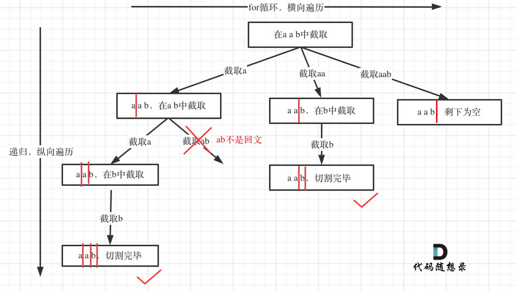

# 回溯算法

- 解决问题的类型
    - 组合问题:N个数里找出K个数的集合
    - 切割问题:一个字符串按一定规则有几种切割方式
    - 子集问题:一个N个数的集合里有多少符合条件的子集
    - 排列问题:N个数按一定规则全排列,有几种排列方式
    - 棋盘问题:N皇后,解数独等

- 回溯法模板(来自代码随想录)
```c++
void backtracking(args){
    if(终止条件){
        存放结果;
        return;
    }

    for(选择本层集合中的元素){ //横向遍历
        处理节点;
        backtracking(args); //纵向遍历
        回溯,撤销处理结果;
    }
}
```

### 组合问题(leetcode 77)
给定两个整数 n 和 k，返回范围 [1, n] 中所有可能的 k 个数的组合。
示例:
```
输入：n = 4, k = 2
输出：
[
  [2,4],
  [3,4],
  [2,3],
  [1,2],
  [1,3],
  [1,4],
]
```
```c++
    void backtracking(int begin, int end, int k, vector<int>& path, vector<vector<int>>& result){
        if(path.size()==k){
            result.push_back(path); //处理
            return;
        }
        for(int i=begin;i<=end;i++){
            if(end-i+1+path.size()<k) return; //减枝(组成组合的元素的数量不够了)
            path.push_back(i);
            backtracking(i+1,end,k,path,result);
            path.pop_back();
        }

    }
```
### 子集问题(leetcode 78)
给你一个整数数组 nums ，数组中的元素 互不相同 。返回该数组所有可能的子集（幂集）。
示例:
```
输入：nums = [1,2,3]
输出：[[],[1],[2],[1,2],[3],[1,3],[2,3],[1,2,3]]
```
```c++
    void backtracking(int begin, int end, const vector<int>& nums,vector<int>& path, vector<vector<int>>& result){
        if(begin == end){
            return;
        }

        for(int i=begin; i<end;i++){ 
            path.push_back(nums[i]);
            result.push_back(path); //处理
            backtracking(i+1,end,nums,path,result);
            path.pop_back();
        }
    }
```

### 排列问题(leetcode 46)
给定一个不含重复数字的数组 nums ，返回其 所有可能的全排列 。你可以 按任意顺序 返回答案。
示例:
```
输入：nums = [1,2,3]
输出：[[1,2,3],[1,3,2],[2,1,3],[2,3,1],[3,1,2],[3,2,1]]
```
```c++
    vector<vector<int>> res;
    vector<int> path;
    vector<vector<int>> permute(vector<int>& nums) {
        vector<bool> used(nums.size(),false);
        backtracking(used, nums);
        return res;
    }

    void backtracking(vector<bool>& used, const vector<int>& nums){
        if(path.size()==nums.size()){
            res.push_back(path);
            return;
        }
        for(int i=0; i<nums.size();i++){
            if(used[i]) continue; //去重，树枝去重(排列问题)
            used[i]=true;   
            path.push_back(nums[i]);
            backtracking(used, nums);
            used[i]=false;
            path.pop_back();
        }
    }
```

### 切割问题
给你一个字符串 s，请你将 s 分割成一些子串，使每个子串都是 回文串 。返回 s 所有可能的分割方案。
示例:
```
输入：s = "aab"
输出：[["a","a","b"],["aa","b"]]
```
切割树的形状!!!


```c++
    void backtracking(int begin, const string& s){
        if(begin >= s.size()){
            res.push_back(path);
            return;
        }
        for(int i=begin;i<s.size();i++){
            if(!isPalindrome(s.substr(begin,i-begin+1))) continue;
            path.push_back(s.substr(begin,i-begin+1));
            backtracking(i+1,s);
            path.pop_back();

        }
    }
```

### 去重!
组合:
给定一个候选人编号的集合 candidates 和一个目标数 target ，找出 candidates 中所有可以使数字和为 target 的组合。

candidates 中的每个数字在每个组合中只能使用 一次 。

注意：解集不能包含重复的组合。 
```
输入: candidates = [10,1,2,7,6,1,5], target = 8,
输出:
[
[1,1,6],
[1,2,5],
[1,7],
[2,6]
]
```
```c++
    vector<int> path;
    vector<vector<int>> res;

    vector<vector<int>> combinationSum2(vector<int>& candidates, int target) {
        sort(candidates.begin(),candidates.end());//为了防止重复,例如[1,7]和[7,1]是同个元素
        
        backtracking(0, 0,target, candidates);
        return res;
    }

    void backtracking(int begin, int sum, int target,const vector<int>& candidates){
        if(sum>target) return;
        if(sum==target){
            res.push_back(path);
            return;
        }
        int used[50]={0};// 哈希表(题目限制数字范围在1~50),保证同一层不能重复使用，树层去重
        for(int i=begin;i<candidates.size();i++){           
            if(sum+candidates[i]>target) continue;
            if(i>0 && candidates[i]==candidates[i-1] && used[candidates[i]-1]==1) continue; //同一层不能重复使用
            used[candidates[i]-1]=1;
            //if(i>begin && candidates[i]==candidates[i-1] ) continue; //另一种保证同一层不能重复使用,不适用used数组,但只能在数组排序的情况下使用
            path.push_back(candidates[i]);
            backtracking(i+1,sum+candidates[i],target,candidates);
            // used[i]=false;
            path.pop_back();
        }
    }
```
子集
给你一个整数数组 nums ，其中可能包含重复元素，请你返回该数组所有可能的子集（幂集）。

解集 不能 包含重复的子集。返回的解集中，子集可以按 任意顺序 排列。
```
输入：nums = [1,2,2]
输出：[[],[1],[1,2],[1,2,2],[2],[2,2]]
```
```c++
    //跟组合一样的去重逻辑
    vector<vector<int>> res;
    vector<int> path;
    vector<vector<int>> subsetsWithDup(vector<int>& nums) {
        sort(nums.begin(),nums.end());
        res.push_back(path);
        backtracking(0,nums);
        return res;
    }

    void backtracking(int begin, const vector<int>& nums){
        if(begin>=nums.size()){
            return;
        }
        int used[21]={0};
        for(int i=begin;i<nums.size();i++){
            if(i>0 && nums[i]==nums[i-1]&&used[nums[i]+10]==1) continue;           
            used[nums[i]+10]=1;
            //if(i>begin && nums[i]==nums[i-1]) continue;
            path.push_back(nums[i]);
            res.push_back(path);
            backtracking(i+1, nums);
            path.pop_back();
        }
    }
```

排列
给定一个可包含重复数字的序列 nums ，按任意顺序 返回所有不重复的全排列。
```
输入：nums = [1,1,2]
输出：
[[1,1,2],
 [1,2,1],
 [2,1,1]]
```

```c++
    //代码随想录的树层去重是通过sort排序加前后元素比较完成的
    vector<vector<int>>res;
    vector<int> path;

    vector<vector<int>> permuteUnique(vector<int>& nums) {
        vector<bool> used(nums.size(),false);
        backtracking(used, nums);
        return res;
    }

    void backtracking(vector<bool>& used, const vector<int>& nums){
        if(path.size()==nums.size()){
            res.push_back(path);
            return;
        }
        int lev[21]={0}; //树层去重
        for(int i=0; i<nums.size();i++){
            if(used[i] || lev[nums[i]+10]==1) continue;
            lev[nums[i]+10]=1;
            used[i]=true; //树枝去重（全排列必须要的）
            path.push_back(nums[i]);
            backtracking(used, nums);
            used[i]=false;
            path.pop_back();
        }
    }
```