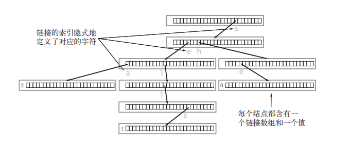

# 前缀树Trie

可以看成是多叉树，每个节点包含一个哈希表，能快速检查是否包含前缀和单词

包含三个单词 "sea","sells","she" 的 Trie 的形式：


代码实现：
```C++
#include <iostream>
#include <vector>
using namespace std;

class Trie {
private:
    struct Node{
        bool isEnd;
        vector<Node*> children;
        Node():isEnd(false), children(26, nullptr){}
    };

    vector<Node*>pool; //内存池  vector<Node*>pool(1,nullptr)会报错，编译器会认为pool是未实现的一个函数
    //vector<Node*>pool={nullptr}; // 这么初始化也行

    Node* SearchPrefix(const string& word){
        Node* node= pool[0];
        for(char c:word){
            if(node->children[c-'a']==nullptr){
                return nullptr;
            }
            node=node->children[c-'a'];
        }
        return node;
    }
public:
    Trie():pool(1, nullptr){
        //pool(1); // 编译器会认为pool(1,nullptr)是一个函数
        pool[0]=new Node();
    }

    ~Trie(){
        int i=0;
        for(auto&& t:pool){  //右值引用？？？
            cout<<"~tris :"<<i++<<endl;
            delete t;
        }
    }

    void Insert(const string & word) {
        Node* node= pool[0];
        for(char c:word){
            if(node->children[c-'a'] == nullptr){
                node->children[c-'a']=new Node();
                pool.emplace_back(node->children[c-'a']);  
            }
            node=node->children[c-'a'];
        }
        node->isEnd=true;
    }

    bool Search(const string& word) {
        return (SearchPrefix(word) != nullptr) && (SearchPrefix(word)->isEnd);
    }

    bool StartsWith(const string& prefix) {
        return SearchPrefix(prefix) != nullptr;
    }
};


int main() {
    Trie trie;
    trie.Insert("apple");
    cout << trie.Search("apple") << endl;   // 返回 True
    cout << trie.Search("app") << endl;     // 返回 False
    cout << trie.StartsWith("app") << endl; // 返回 True
    trie.Insert("app");
    cout << trie.Search("app") << endl;     // 返回 True
    //trie.Insert("spp");

    return 0;
}
```