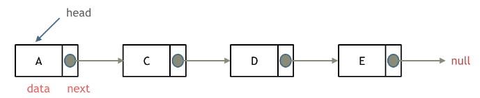

# 链表

## 特点

通过指针串联到一起的线性结构，每一个节点包括数据域和指针域
- 存储方式：在内存中不连续
- 元素可以删除，查找效率低，插入效率高




## 库函数 List 双向链表
- 特点：任意位置插入或删除的时间都是固定的，强调元素的快速插入和删除
- 声明：`template < class T, class Alloc = allocator<T> > class list;`
- 初始化：
```C++
// constructing lists
#include <iostream>
#include <list>

int main ()
{
  // constructors used in the same order as described above:
  std::list<int> first;                                // empty list of ints
  std::list<int> second (4,100);                       // four ints with value 100
  std::list<int> third (second.begin(),second.end());  // iterating through second
  std::list<int> fourth (third);                       // a copy of third

  // the iterator constructor can also be used to construct from arrays:
  int myints[] = {16,2,77,29};
  std::list<int> fifth (myints, myints + sizeof(myints) / sizeof(int) );

  std::cout << "The contents of fifth are: ";
  for (std::list<int>::iterator it = fifth.begin(); it != fifth.end(); it++)
    std::cout << *it << ' ';

  std::cout << '\n';

  return 0;
}
```
- 成员函数
  - 迭代器
    - begin       返回开始的迭代器
    - end         返回结束的迭代器
    - rbegin      返回反向开始的反向迭代器
    - rend        返回反向结束的反向迭代器
    - cbegin      返回开始的const迭代器
    - cend        返回结束的const迭代器
    - crbegin     返回反向开始的const迭代器
    - crend       返回反向结束的const迭代器
  - 容量相关
    - empty         返回是否为空
    - size          返回size
    - max_size      返回能存储最大元素的个数（测试为768614336404564650，不同机器不一样）
    - resize        调整size，size变小删除多余元素，size变大补0或参数值
    - clear         清空
  - 元素访问
    - front         返回首元素
    - back          返回尾部元素
  - 元素调整
    - pop_front     首部弹出
    - push_front    首部插入
    - pop_back    尾部弹出
    - push_back   尾部插入
    - insert      插入单个或多个元素在任意位置
    - erase       擦除任意位置的单个或多个元素
    - swap        交换两个vector（可以是不同大小）
    - emplace     构造和插入元素 
    - emplace_back    在尾部构造和插入元素 
    - remove        移除元素
    - remove_if     按条件移除
  - 操作
    - sort          排序
    - merge         合并
    - reverse       翻转
    - unique        移除重复元素（使用之前需要先sort）
    - splice        切片

