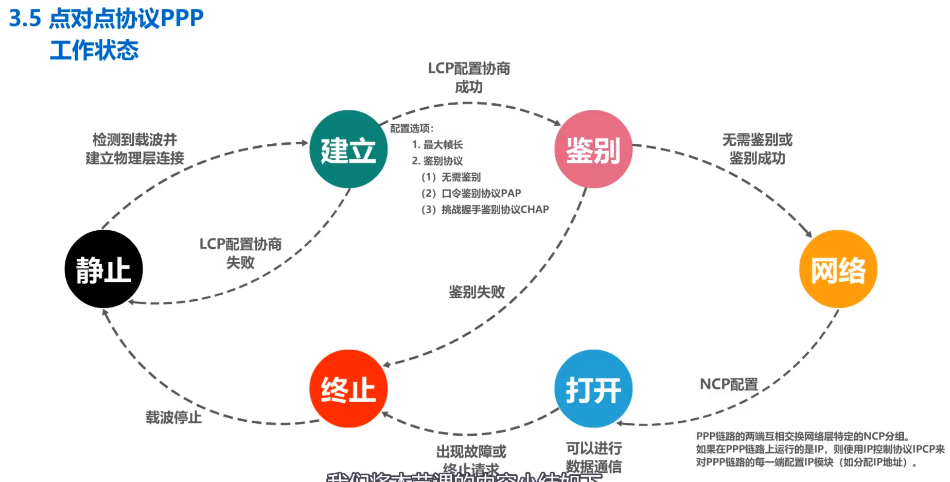
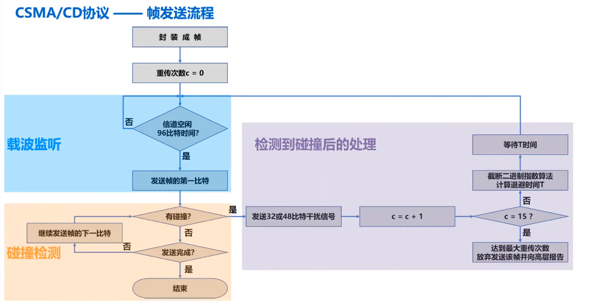
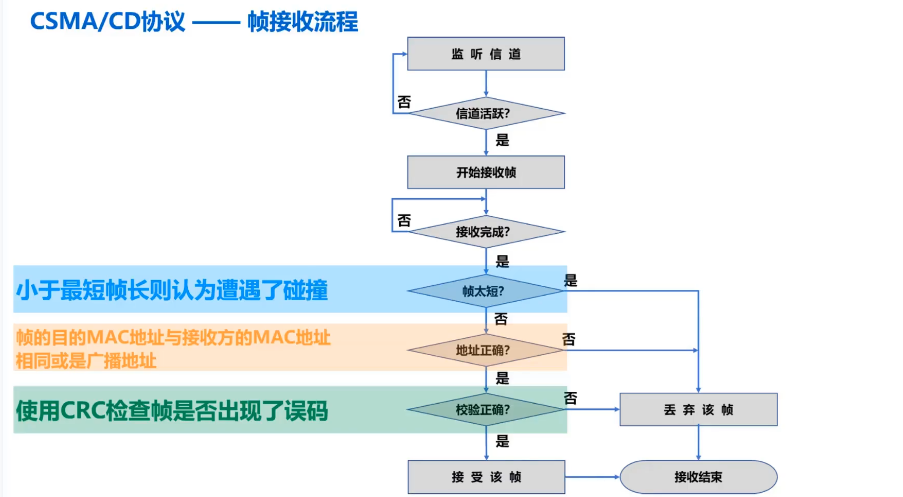
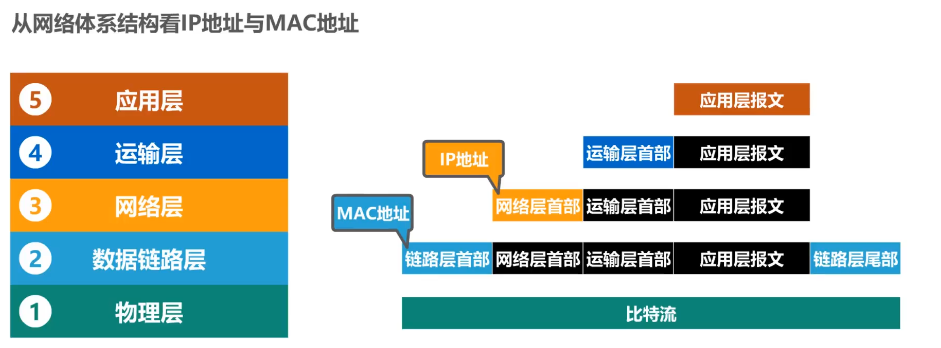
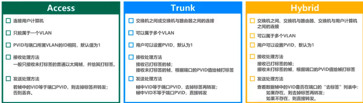

# 数据链路层

## 三个重要问题
- 封装成帧：添加帧头和帧尾
  - 帧头信息：
    - 目的地址： 6字节
    - 源地址：   6字节
    - 类型：     2字节
  - 帧尾信息：
    - 检错码：   4字节
- 差错检测
- 可靠传输：发送方发送什么，接收方都能收到

## 封装成帧
- 添加帧头和帧尾
- 帧定界
- 透明传输：对上层交付的传输数据没有限制，如果传输数据中包含帧定界符，插入转义字符或比特填充
- 提高帧的传输效率，增大帧的数据部分

## 差错检测 
- FCS ->检错码
- 奇偶校验 漏检率较高
- 循环冗余校验CRC：双方约定好一个生成多项式，基于生成多项式计算差错检测码，将其添加到传输数据后一起传输，接收方通过生成多项式计算是否产生误码（余数是否为0）
  
## 可靠传输

- 停止等待协议： 超时计时器->超时重传    数据和确认信号增加序号->防止重复确认   信道利用率较低
- 回退N帧协议
- 选择重传协议

## 点对点协议 PPP
- 对各种协议数据报的封装方法
- 链路控制协议LCP
- 一套网络控制协议NCPs
- 提供不可靠传输服务
  格式：
  F A C P 帧的数据部分 FCS F
  - F：标志字段，1字节，定界符，取值为0x7E
  - A: 地址字段，1字节，取值为0xFF，预留（目前没什么作用）
  - C：控制字段，1字节，取值为0x03，预留（目前没什么作用）
  - P: 协议字段，2字节，指明帧的数据部分送交哪个协议处理
    - 取值为0x0021：IP数据报
    - 取值为0xC021：LCP分组
    - 取值为0x8021：NCP分组
  - FCS: 帧检验序列字段，2字节，CRC计算出的额校验位
  透明传输：
    - 面向字节的异步链路：字节填充法
    - 面向比特的同步链路：比特填充法

协议流程：

## 媒体接入控制
- 静态划分信道： 预先分配好信道，不灵活，对于突发性数据传输信道利用率较低，通常在无线网络的物理层中使用，而不是数据链路层。
  - 频分多址
  - 时分多址
  - 码分多址
- 动态接入控制
  - 受控接入： 已被淘汰
    - 集中控制：主站进行轮询，被轮询到的站点才能发送数据，存在单点故障问题
    - 分散控制：各站点平等的形成一个环形网络，令牌沿着环传递，接收到令牌的站点才可以发送数据（IEEE 802.5令牌环网，IEEE 802.4令牌总线网）
  - 随机接入：各站点通过竞争随机的在信道上发送数据，关键问题是如何尽量避免冲突和冲突后尽快回复通信（共享式以太网）
  

### CSMA/CD 载波监听多址接入/碰撞检测
- 多址接入MA：多个站连接到一条总线上，竞争使用总线
- 载波监听CS：每一个站在发送帧之前都先要检测一下总线上是否有其他站点在发送帧，若总线空闲96比特时间，则开始发送，若总线忙，则继续检测并等待空闲96比特时间
- 碰撞检测CD：每一个正在发送帧的站边发送边检测，一旦发现碰撞，立即停止发送，退避一段随机事件后再次发送

- 争用期：以太网单程端到端传播时延为t，则主机最多经过2t就可以检测出是否发生了碰撞，2t称为争用期货碰撞窗口，主机越多，发生碰撞的概率就越大，所以共享式以太网不能连接太多的主机
- 最小帧长： 最小帧长为64字节，即512比特，保证主机能检测出碰撞
- 最大帧长：1528字节，防止长时间占用总线和缓冲区溢出

- 截断二进制指数退避算法
发送方流程

接收方流程

### CSMA/CA 载波监听多址接入/碰撞避免 （802.11无线局域网）
- 无线电波进行碰撞检测比较困难，无线信号的的强度动态范围较大
- 不可能避免所有碰撞，数据链路层还使用了确认机制（停止等待协议），保证数据被正确接收
- MAC层媒体接入方式：
  - 分布式协调功能DCF,没有中心控制站点，默认方式
  - 点协调功能PCF，集中控制的接入算法，实际中使用较少
- 帧间间隔：
  - 所有站点必须在持续监测到信道空闲一段指定时间后才能发送帧
  - 帧的类型决定帧间间隔的长短：高优先级的帧需要等待的时间较短。
  - 常用帧间间隔SIFS：
    - 短时间间隔：28微秒，分割属于一次对话的各帧
    - DCF帧间间隔：128微秒，用来发送数据帧和管理帧

## 地址

- MAC地址：也称为硬件地址和物理地址，以太网的MAC子层所使用的地址 --》数据链路层
- IP地址：TCP/IP体系结构中网际层使用的地址 --》网际层（就是网络层）
- ARP协议：通过IP地址获取设备的MAC地址  --》网际层

### IEEE 802局域网的MAC地址
- EUI-48 : 48比特 6字节 
  - 前三个字节为组织唯一标识符OUI：由IEEE的注册管理机构分配
  - 网络接口标识符：由获得OUI得厂商自行随意分配
  - 标准表示法：16进制：XX-XX-XX-XX-XX-XX
- 单播MAC地址：接受方与地址匹配才接受
- 广播MAC地址：FF-FF-FF-FF-FF-FF
- 多播MAC地址：看接收方的多播组列表中是否包含帧的多播地址

### IP地址

- 作用：主机和路由器所使用的地址
  - 网络编号：标识因特网上的网络
  - 主机编号：标识同一网络上的不同主机

- 数据包转发过程中，源IP地址和目的IP地址不变，源MAC地址和目的MAC地址逐段链路（逐个网络）改变

### ARP协议     地址解析协议 

- ARP高速缓存表
  - 动态： 自动获取，生命周期默认为两分钟
  - 静态： 手工设置，不同操作系统下生命周期不同，例如系统重启后存在或不存在
- ARP请求报文（广播）
  - 只能在一段链路上使用，不能跨网络使用
- 没有安全验证机制，存在ARP欺骗和攻击等问题

### 集线器和交换机

- 集线器 （淘汰）
  - 使用集线器的以太网在逻辑上还是一个总线网，各站共享资源，使用的是CSMA/CD协议
  - 只工作在物理层，每个接口仅简单的转发比特，不进行碰撞检测（由网卡检测）
  - 少量的容错和网络管理能力
  - 半双工工作方式

- 以太网交换机
  - 多个接口，全双工工作方式
  - 并行性，同时连通多对接口，使多对主机能同时通信，无碰撞
  - 支持多种速率的接口
  - 工作在数据链路层（包括物理层）
  - 即插即用，帧交换表是通过自学习自动建立，定期删除
  - 帧的转发方式
    - 存储转发 
    - 直通交换：直接转发，基于硬件交叉矩阵（交换时延很小，但不检查是否存在差错）

### 以太网交换机自学习和转发帧的流程

- 交换机刚上电启动时内部交换表是空的，随着网络中各主机间的通信，以太网交换机通过自学习算法自动逐渐建立帧交换表
- 帧交换表如果找不到，则进行盲目转发
- 生成树协议STP
  - 网络环路
    - 广播风暴：大量消耗网络资源，使得网络无法正常工作
    - 主机收到重复的广播帧
    - 交换机的帧交换表震荡（漂移）
  - 生成树协议：避免网络环路

### 虚拟局域网技术VLAN
  - 将局域网内部的设备划分成与物理位置无关的逻辑组技术，同一个VLAN中可以实现广播通信
  - 实现机制：
    - 对交换机的要求：能处理IEEE 802.1Q帧（打上vlan标签），交换机的各端口支持不同的端口类型
  - 交换机的端口类型：
    - Access：用来连接用户计算机，只能属于一个VLAN，（打标签转发，pvid相等去标签接收）
    - Trunk：用于交换机之间或与路由器之间的互连，可以属于多个VLAN，（pvid相等去标签转发，pvid不等直接转发，接受已打标签的帧直接转发，未打标签的打上trunk端口的标签再转发）
    - Hybrid：可用于交换机之间或与路由器之间的互连，也可用于连接用户计算机，可以属于多个VLAN（发送处理方法：查看帧的VID是否在端口的去标签列表中，若存在，则去标签再转发，若不存在直接转发：接受同Trunk端口）

