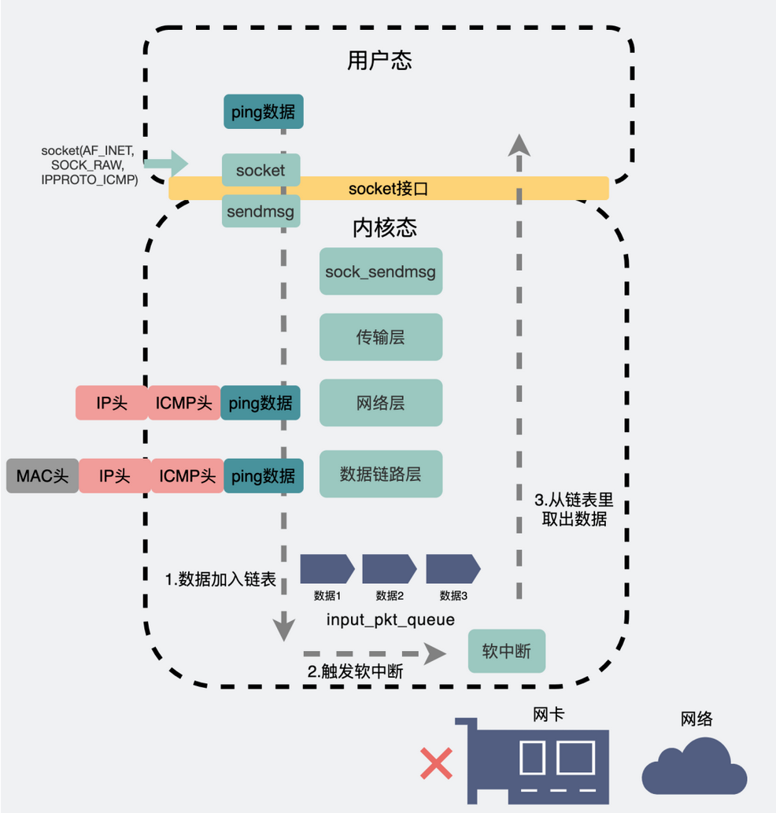

可以的,ping回环地址
从应用层到传输层再到网络层。这段路径跟ping外网的时候是几乎是一样的。到了网络层，系统会根据目的IP，在路由表中获取对应的路由信息，而这其中就包含选择哪个网卡把消息发出。
当发现目标IP是外网IP时，会从"真网卡"发出。
当发现目标IP是回环地址时，就会选择本地网卡。

本地网卡，其实就是个**"假网卡"，它不像"真网卡"那样有个ring buffer什么的，"假网卡"会把数据推到一个叫 input_pkt_queue 的 链表 中。这个链表，其实是所有网卡共享的，上面挂着发给本机的各种消息。消息被发送到这个链表后，会再触发一个软中断**。

专门处理软中断的工具人**"ksoftirqd"** （这是个内核线程），它在收到软中断后就会立马去链表里把消息取出，然后顺着数据链路层、网络层等层层往上传递最后给到应用程序。

127.0.0.1 是回环地址。localhost是域名，但默认等于 127.0.0.1。
ping 回环地址和 ping 本机地址，是一样的，走的是lo0 "假网卡"，都会经过网络层和数据链路层等逻辑，最后在快要出网卡前狠狠拐了个弯， 将数据插入到一个链表后就软中断通知 ksoftirqd 来进行收数据的逻辑，压根就不出网络。所以断网了也能 ping 通回环地址。
如果服务器 listen 的是 0.0.0.0，那么此时用127.0.0.1和本机地址都可以访问到服务。